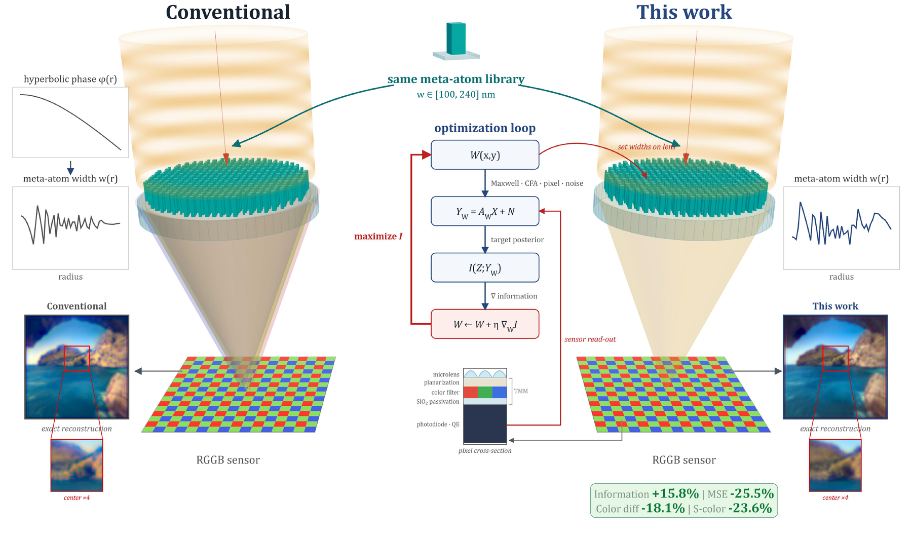
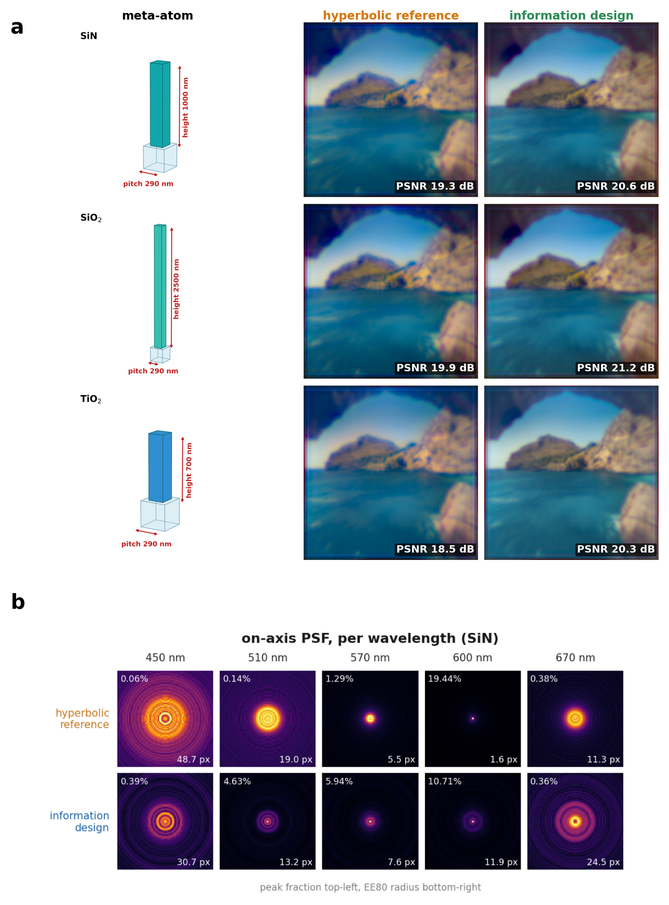
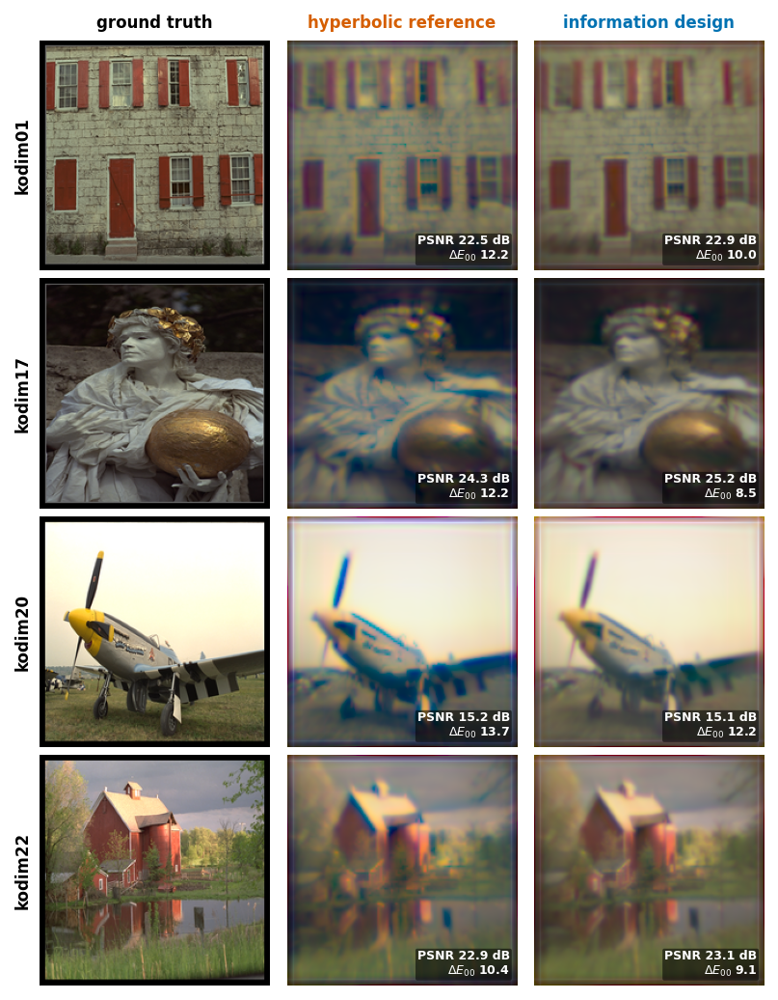
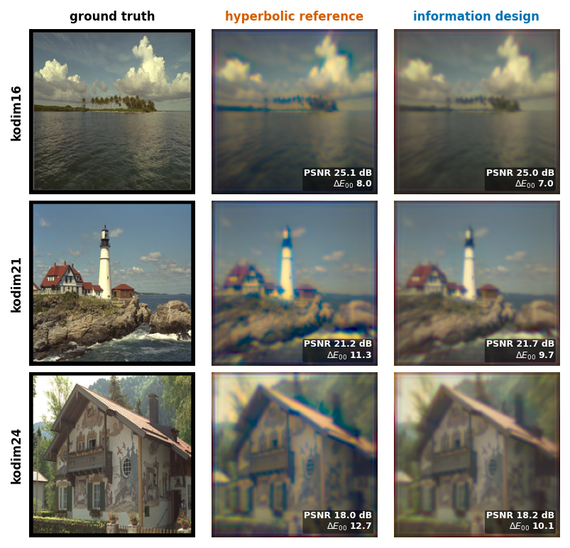

# metalens-information-design

[](https://doi.org/10.5281/zenodo.22100294)

Code for *Information-Optimized Design of Color Metalenses without a Prescribed Phase*.

A rigorous full-Jones forward model for a single-layer metalens in front of an
RGGB colour filter array, the target-information objective that the design
maximizes, three published width maps, and a script that reproduces their
reported numbers.

## The result

|  | hyperbolic reference | information design | MTF-volume control |
|---|---|---|---|
| target information $I_{\mathrm{tar}}$ (bit/raw px) | 0.5059 | **0.5860** (+15.8 %) | 0.4180 (−17.4 %) |
| PSNR (dB) | 19.30 | **20.58** (+1.28 dB) | 17.60 |
| $\Delta E_{00}$ | 12.05 | **9.87** (−18.1 %) | 15.71 |
| S-CIELAB | 21.35 | **16.31** (−23.6 %) | — |
| collected charge (model-e⁻/raw px) | 724.0 | 624.4 (−13.8 %) | 274.8 |

`reproduce.py` recomputes the target information $I_{\mathrm{tar}}$ row from the
published width maps. PSNR, $\Delta E_{00}$ and S-CIELAB are the high-signal-to-noise
reconstruction metrics on the held-out landscape scene (the manuscript does not
report an S-CIELAB value for the MTF-volume control).

Fixed across all three: Si₃N₄ pillars, 1000 nm tall, 290 nm pitch, 208 µm
aperture, NA 0.3, *f* = 346.7 µm, widths 0.10–0.24 µm, a 720 × 720 lattice
of 518,400 sites. **The only variable is the width map.**

## Figures



**Conventional design versus this work.** Both routes draw meta-atoms from the
same width library and see the same focusing geometry and RGGB detector. The
conventional route prescribes a hyperbolic phase and matches a width to it at
each radius, so the camera never enters the design. Here no phase is prescribed:
the width map is optimized directly against the information the raw camera
measurement carries about the desired image, with a hyperbolic map used only to
initialize the search.



**The same width-only optimization on three meta-atom libraries.** Reconstructed
landscape for SiN, SiO₂ and TiO₂ (rows) under the hyperbolic reference and the
information design (columns), each formed by direct full-scene propagation and
reconstructed under its own analytic colour calibration. PSNR rises from 19.3 to
20.6 dB (SiN), 19.9 to 21.2 dB (SiO₂) and 18.5 to 20.3 dB (TiO₂). The lower
panel shows the per-wavelength on-axis PSF for SiN: the reference concentrates
its focus near 600 nm and blurs the blue channel, and the information design
flattens the focus across the band.




**Seven further held-out natural scenes (Kodak test images).** Rendered through
the identical pipeline, the information design lowers the colour error on every
scene (mean ΔE₀₀ 11.52 → 9.53) and raises PSNR on five of the seven (mean
+0.30 dB). Per-scene values are in the manuscript's Supplementary Note 9.

## Quickstart

```
pip install -r requirements.txt
python reproduce.py                    # all three designs
python reproduce.py --designs information --device cuda
```

`reproduce.py` scores each stored width map through the full-Jones forward model
over a 25-point field quadrature and nine wavelengths, and checks the weighted
$I_{\mathrm{tar}}$ against `records/expected.json` within a 1 % relative
tolerance. The vectorial forward is heavy: about 15 min per design and about
15 GB of peak memory on CPU, and much faster on CUDA.

To run the optimization method itself:

```
python optimize.py --device cuda --out out/optimized.pt
python optimize.py --device cpu --steps 2       # short smoke test
```

`optimize.py` starts from the projected hyperbolic reference and maximizes
$I_{\mathrm{tar}}$ by differentiating through the full-Jones forward model:
300 projected-Adam steps on the mirror-quadrant width map, four stochastic field
samples per step, a cosine schedule from $1.6\times10^{-2}$ to $10^{-5}$,
25-field validation every ten steps, and a five-step full-field refinement.
Re-running does not return the published map exactly, because the field draw is
stochastic and the objective non-convex. A full run is only practical on CUDA.

Tested on Python 3.12, torch 2.6.0+cu118.

## Interactive designer (local web app)

`webapp/` provides a local browser console around the same optimization: set the
lens specification (aperture diameter, focal length, field of view, CFA,
optimization budget), launch the $I_{\mathrm{tar}}$ width-map optimization on
your own GPU, and watch a live optical-layout cross-section, the evolving width
map, the $I_{\mathrm{tar}}$ curve and a progress bar. On completion it renders
the on-axis PSF and channel MTF and offers the width map for download.

```
pip install fastapi uvicorn
python webapp/server.py
# open http://127.0.0.1:8642        (append ?mock=1 for a no-GPU demo)
```

The sensor sampling contract is fixed (1 um pixels on a 0.25 um scene grid, the
64-alias polyphase operator, nine design wavelengths, the SiN library); aperture
diameter, focal length, field of view, CFA and the optimization budget are free.
See [`webapp/README.md`](webapp/README.md) for the parameter reference and
hardware requirements.

## What is here

| capability | where |
|---|---|
| the full-Jones meta-atom response | `mosaic_metalens/fulljones/metalens_response.py` |
| the vectorial forward optical chain | `mosaic_metalens/fulljones/pipeline_forward.py` |
| the 64-alias RGGB polyphase operator | `mosaic_metalens/fulljones/production_multirate.py` |
| the target-information objective $I_{\mathrm{tar}}$ | `mosaic_metalens/fulljones/scoring.py` |
| the low-memory posterior determinant | `mosaic_metalens/fulljones/polyphase_mmse.py` |
| the mirror-quadrant width parameterization and projected optimizer | `mosaic_metalens/fulljones/optim_widthmap.py`, `projected_width_optimizer.py` |
| the optimization driver | `optimize.py` |
| the three published designs | `designs/` |
| the full-Jones LUT and scene prior | `data/fulljones/` |

## The physics chain

An object-plane point source is propagated to the pupil with a double-precision
spherical phase. Each pillar applies its full 2×2 Jones transmission from a
rigorous coupled-wave-analysis lookup, angle-resolved in polar angle and azimuth
and completed by the C4 symmetry of the square post, interpolated bilinearly and
differentiably in the width. The two orthogonal input polarizations propagate
coherently to the sensor by a non-paraxial angular spectrum with the evanescent
cut, then combine incoherently. A planar back-illuminated pixel stack turns field
into photodiode irradiance, a sliding photosite aperture and 2×2 decimation land
it on the RGGB readout grid, and a frozen common exposure converts to
model-electrons. The 64-alias RGGB polyphase operator maps the latent scene to
the four raw phases, and the target posterior covariance gives
$I_{\mathrm{tar}}$.

## What is not here

- **The full design campaign.** This repository releases three designs and the
  method (`optimize.py`) that produced them. Further arms are outside this release.
- **No fabricated or measured optic.** Every number comes from the forward model.

## Data provenance

- Scene prior: derived from Morimoto et al. reflectance and daylight spectra
  (CC BY 4.0, [10.5281/zenodo.5217752](https://doi.org/10.5281/zenodo.5217752))
  and the CIE 1931 2° colour-matching functions.
- Camera spectral sensitivities: Tominaga, Nishi and Ohtera, *Sensors*
  **21**(15):4985 (2021).
- Meta-atom library: computed with TORCWA (Kim and Kim, *Comput. Phys. Commun.*
  **282**:108552, 2023).

Numerical conventions and provenance controls (exposure calibration, evaluator,
checkpoint selection, image-formation vs metrics) are documented in
[`VALIDATION.md`](VALIDATION.md).

## Citation

```bibtex
@misc{Park2026TargetPosteriorMetalens,
  author = {Park, Hyoseok and Park, Yeonsang},
  title  = {Information-Optimized Design of Color Metalenses without a Prescribed Phase},
  year   = {2026},
  note   = {arXiv preprint}
}
```

The archived software release is citable as
[10.5281/zenodo.22100294](https://doi.org/10.5281/zenodo.22100294).

See `CITATION.cff` for the software citation.

## Licence

All rights reserved. This code accompanies the manuscript for review and
reproduction; contact the authors for other use. The bundled data files keep
their own terms.
